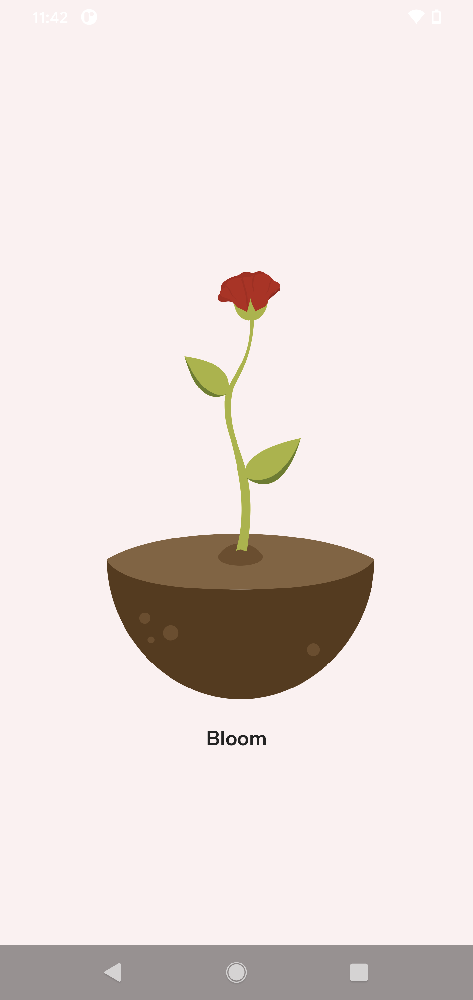
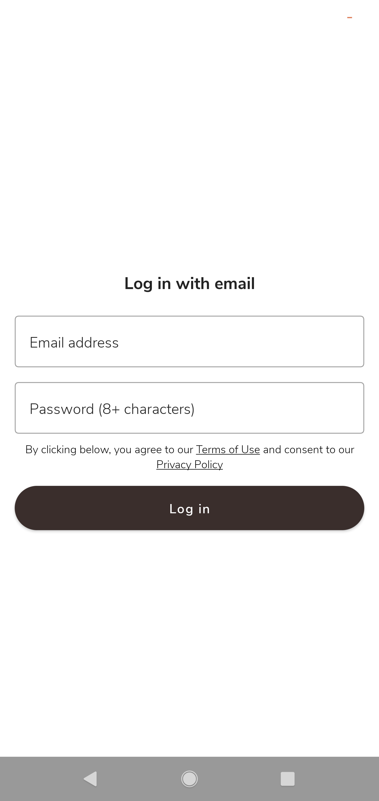
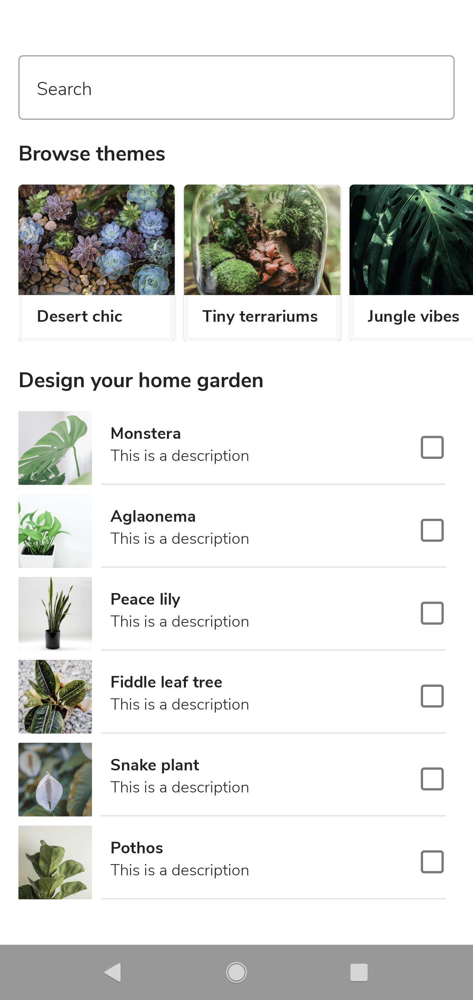

# Bloom Android App

Beautiful home garden solution Android app developed using latest Android UI tool Jetpack Compose and implemented most of the new Android APIs.

## App Screens
## Light Theme
   
## Dark Theme
   

## Introduction
Beautiful home garden solution Android app developed using latest Android UI tool Jetpack Compose and implemented most of the new Android APIs.

## Development IDE
- Android Studio Arctic Fox | 2020.3.1 Canary 14

## Latest Android libraries/components used:
- [Jetpack Compose](https://developer.android.com/jetpack/compose)
- [Jetpack Compose Navigation](https://developer.android.com/jetpack/compose/navigation)
- [Bottom Navigation Bar](https://developer.android.com/jetpack/compose/navigation#bottom-nav)
- [Architecture Componenets ViewModel](https://developer.android.com/topic/libraries/architecture/viewmodel)
- [Hilt Dependency Injection](https://developer.android.com/training/dependency-injection/hilt-android)
- [Room Database](https://developer.android.com/training/data-storage/room)
- [Coil Image Loading library with Accompanist](https://google.github.io/accompanist/coil/)
- [Lottie Animation with Jetpack Compose](https://airbnb.io/lottie/#/android-compose)

## App Architecture
- [Unidirectional data flow(UDF) Architecture] (https://developer.android.com/jetpack/compose/architecture#udf)


## BackEnd Server
- Firebase Authentication
- Firebase FireStore
- Firebase Storage
- Firebase Analytics

## Note
- This app is my demo application to explore all new Android features and APIs on my free time.
- Complete app developed with one single Activity
- Complete app developed without using traditional UI fragments and XML layouts

## License
```
Copyright 2020 The Android Open Source Project

Licensed under the Apache License, Version 2.0 (the "License");
you may not use this file except in compliance with the License.
You may obtain a copy of the License at

    https://www.apache.org/licenses/LICENSE-2.0

Unless required by applicable law or agreed to in writing, software
distributed under the License is distributed on an "AS IS" BASIS,
WITHOUT WARRANTIES OR CONDITIONS OF ANY KIND, either express or implied.
See the License for the specific language governing permissions and
limitations under the License.
```
