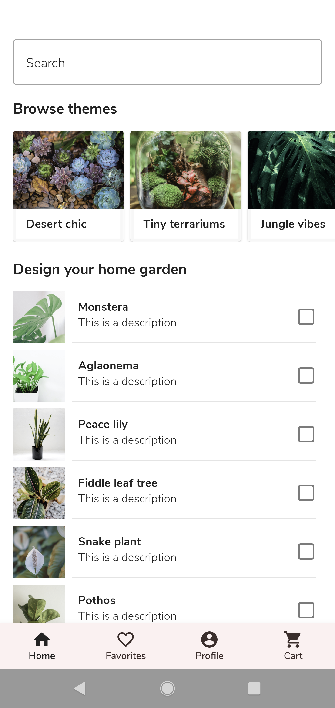
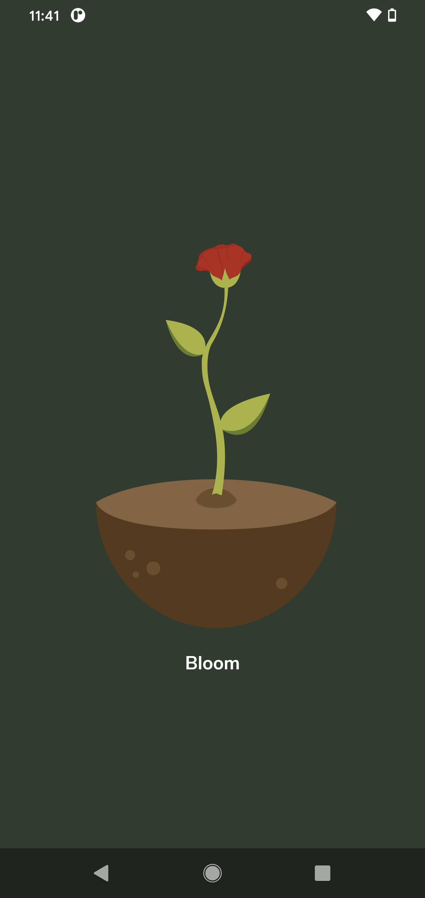

# Bloom Android App

Beautiful home garden solution Android app developed using latest Android UI tool Jetpack Compose and implemented most of the new Android APIs.

## App Available on Google Play Store

## App Screens
## Light Theme
   
## Dark Theme
   

## Introduction
Beautiful home garden solution Android app developed using latest Android UI tool Jetpack Compose and implemented most of the new Android APIs.

## Development IDE
- Android Studio Arctic Fox | 2020.3.1 Canary 14

## Latest Android libraries/components used:
- [Jetpack Compose](https://developer.android.com/jetpack/compose)
- [Jetpack Compose Navigation](https://developer.android.com/jetpack/compose/navigation)
- [Bottom Navigation Bar](https://developer.android.com/jetpack/compose/navigation#bottom-nav)
- [Architecture Componenets ViewModel](https://developer.android.com/topic/libraries/architecture/viewmodel)
- [StateFlow](https://developer.android.com/kotlin/flow/stateflow-and-sharedflow)
- [Hilt Dependency Injection](https://developer.android.com/training/dependency-injection/hilt-android)
- [Room Database](https://developer.android.com/training/data-storage/room)
- [Coil Image Loading library with Accompanist](https://google.github.io/accompanist/coil/)
- [Lottie Animation with Jetpack Compose](https://airbnb.io/lottie/#/android-compose)
- [App Startup](https://developer.android.com/topic/libraries/app-startup)
- [Work Manager](https://developer.android.com/topic/libraries/architecture/workmanager)
- [Android 12 SplashScreen API with support from API 23](https://developer.android.com/about/versions/12/features/splash-screen)

## App Architecture
- [Unidirectional data flow(UDF) Architecture](https://developer.android.com/jetpack/compose/architecture#udf)

## BackEnd Server
- Firebase Authentication
- Firebase FireStore
- Firebase Storage
- Firebase Analytics

## Note
- This app is my demo application to explore all new Android features and APIs on my free time.
- Complete app developed with one single Activity
- Complete app developed without using traditional UI fragments and XML layouts
- No Fragments
- No XML
- No Data binding
- No LiveData and its dependencies (Used Kotlin StateFlow)

## License
[LICENSE](LICENSE)
