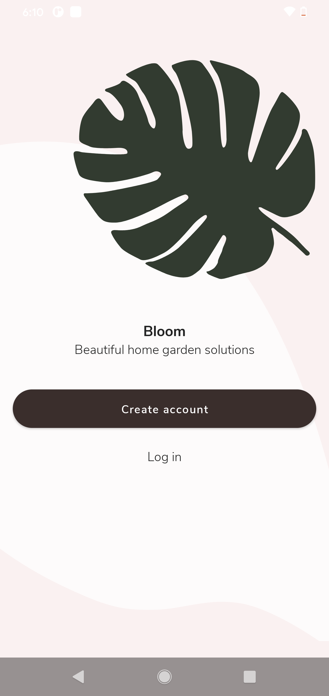
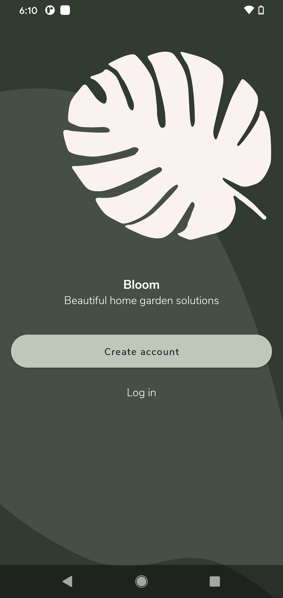

# Bloom Android App

Beautiful home garden solution Android app developed using latest Android UI tool Jetpack Compose and implemented most of the new Android APIs.

## App Screens



## Introduction
Beautiful home garden solution Android app developed using latest Android UI tool Jetpack Compose and implemented most of the new Android APIs.

## Development IDE
- Android Studio Arctic Fox | 2020.3.1 Canary 12

## Latest Android libraries/components used:
- [Jetpack Compose](https://developer.android.com/jetpack/compose)
- [Jetpack Compose Navigation](https://developer.android.com/jetpack/compose/navigation

## Note
This app is my demo application to explore all new Android features and APIs on my free time.

## License
```
Copyright 2020 The Android Open Source Project

Licensed under the Apache License, Version 2.0 (the "License");
you may not use this file except in compliance with the License.
You may obtain a copy of the License at

    https://www.apache.org/licenses/LICENSE-2.0

Unless required by applicable law or agreed to in writing, software
distributed under the License is distributed on an "AS IS" BASIS,
WITHOUT WARRANTIES OR CONDITIONS OF ANY KIND, either express or implied.
See the License for the specific language governing permissions and
limitations under the License.
```
